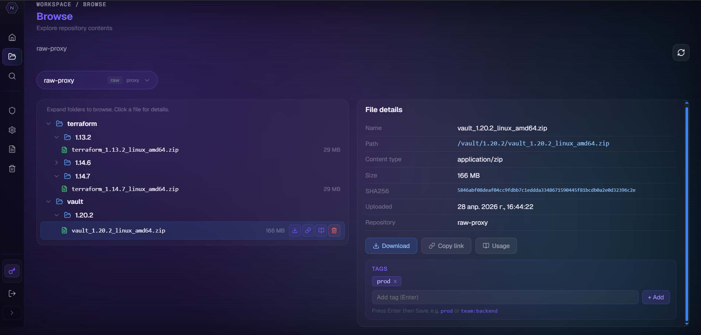
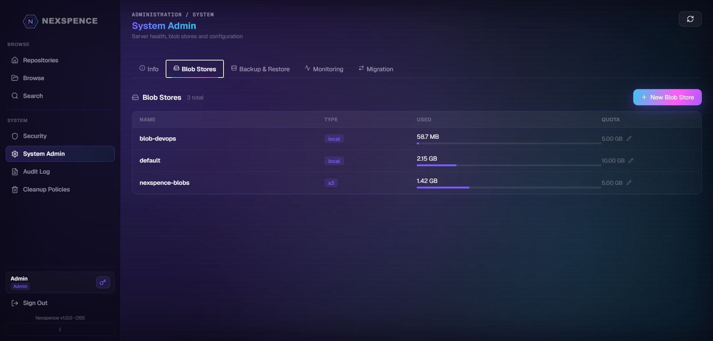
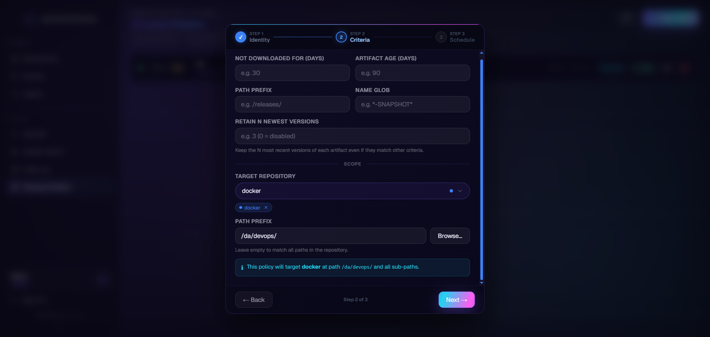

<div align="center">
  
  <br><br>
  <p><strong>Free, open-source universal artifact repository manager</strong></p>
  <p>A full-featured self-hosted alternative to Sonatype Nexus Repository</p>
  <br>

  
  
  
  
  
  
  

</div>

---

## 🎬 Demo

https://github.com/skensell201/nexspence/raw/main/docs/assets/demo.mp4

> ▶️ If the video doesn't play inline, [open / download it here](docs/assets/demo.mp4).

---

## What is Nexspence?

Nexspence is a self-hosted artifact repository manager that supports **14 package formats**, three repository types (hosted, proxy, group), fine-grained RBAC, SSO via OIDC/LDAP, audit logging, S3-compatible storage, and a modern dark-theme web UI — all in a single binary backed by PostgreSQL. It exposes the full **Sonatype Nexus v1 REST API** at `/service/rest/v1/` for drop-in compatibility with existing CI/CD pipelines and package manager configs.

---

## Architecture

```
                         ┌─────────────────────┐
                         │   Load Balancer     │  (nginx / k8s Ingress / ALB)
                         └──────────┬──────────┘
                    ┌───────────────┴───────────────┐
                    ▼                               ▼
┌────────────┐  JWT/Basic  ┌──────────────────┐   ┌──────────────────┐
│  Client    │ ──────────▶ │  Nexspence node 1 │  │  Nexspence node 2│  (HA)
│ (curl/mvn/ │             │  Gin + Auth +     │  │  identical       │
│  pip/npm…) │ ◀────────── │  Audit + RBAC     │  └────────┬─────────┘
└────────────┘             └────────┬──────────┘           │
                                    │                      │
                    ┌───────────────▼──────────────────────▼──────┐
                    │           Shared State                      │
                    │  ┌──────────────┐  ┌─────────┐  ┌──────────┐│
                    │  │  PostgreSQL  │  │  Redis  │  │  S3/MinIO││
                    │  │  (all data)  │  │  (locks │  │  (blobs) ││
                    │  └──────────────┘  │  cache) │  └──────────┘│
                    │                    └─────────┘              │
                    └─────────────────────────────────────────────┘
```

View the full site with interactive architecture diagram, install guide, and comparison: **[nexspence.com](https://nexspence.com)** →

---

## Screenshots

### Dashboard & Repositories

<table>
  <tr>
    <td></td>
    <td></td>
  </tr>
  <tr>
    <td align="center"><em>Repositories list</em></td>
    <td align="center"><em>Browse tree view</em></td>
  </tr>
</table>

### Admin & Security

<table>
  <tr>
    <td></td>
    <td></td>
  </tr>
  <tr>
    <td align="center"><em>Blob stores — S3 + local with connection test</em></td>
    <td align="center"><em>Roles, privileges, content selectors</em></td>
  </tr>
</table>

### Cleanup & Search

<table>
  <tr>
    <td></td>
    <td></td>
  </tr>
  <tr>
    <td align="center"><em>Cleanup policies with dry-run preview</em></td>
    <td align="center"><em>Full-text component search</em></td>
  </tr>
</table>

---

## Quick Start

**Requirements:** [Docker](https://docs.docker.com/get-docker/) 24+ with Compose v2

```bash
git clone https://github.com/skensell201/nexspence
cd nexspence
docker compose up -d
```

| Service | URL | Default credentials |
|---------|-----|---------------------|
| Web UI & REST API | http://localhost:8081 | `admin` / `admin123` |
| Docker registry | localhost:5000 | same credentials |
| PostgreSQL | localhost:5437 | `nexspence` / `nexspence` |

> Change the admin password immediately after first login.

### Docker Compose Profiles

The compose file uses profiles to opt into optional services. Combine as needed:

| Profile | Adds | Command |
|---------|------|---------|
| _(none)_ | Nexspence + PostgreSQL + MinIO | `docker compose up -d` |
| `monitoring` | Prometheus + Grafana | `docker compose --profile monitoring up -d` |
| `keycloak` | Keycloak OIDC IdP | `OIDC_ENABLED=true docker compose --profile keycloak up -d` |
| `keycloak` + `monitoring` | Both | `OIDC_ENABLED=true docker compose --profile keycloak --profile monitoring up -d` |
| `dev` | Vite frontend dev server | `docker compose --profile dev up` |

**Monitoring setup** — before starting the `monitoring` profile, create a Bearer token:

```bash
# Copy the example and fill in a valid nxs_* API token
cp deploy/monitoring/prometheus-token.example deploy/monitoring/prometheus-token
# edit the file and paste your token
```

Once running: Prometheus at **http://localhost:9090** · Grafana at **http://localhost:3000** (admin / admin)

The pre-built Grafana dashboard (`Nexspence Overview`) loads automatically with 8 panels: requests/sec, error rate, latency p95, artifacts, storage, downloads, goroutines, memory.

**Standalone monitoring** (target an existing Nexspence instance):

```bash
cd deploy/monitoring
NEXSPENCE_URL=http://my-server:8081 docker compose up -d
```

For all deployment variants (MinIO, HA cluster, Keycloak SSO, from source) see **[docs/deployment.md](docs/deployment.md)**.

---

## CLI Tool — `nxs`

Manage Nexspence from the terminal or CI/CD pipelines:

```bash
# Install
curl -sSfL https://raw.githubusercontent.com/skensell201/nxs/main/install.sh | sh

# Login and use
nxs login --url http://localhost:8081 --user admin
nxs repo list
nxs push my-repo path/to/artifact.jar artifact.jar
nxs search --repo maven-releases --q mylib --json | jq '.[].version'
```

Full command reference and CI/CD examples: **[github.com/skensell201/nxs](https://github.com/skensell201/nxs)**

---

## Kubernetes (Helm)

**Requirements:** Helm 3.x, Kubernetes >= 1.26

```bash
cd deploy/helm/nexspence && helm dependency update
helm install nexspence \
  deploy/helm/nexspence \
  -f deploy/helm/nexspence/values-examples/nginx.yaml \
  --set config.jwtSecret="$(openssl rand -hex 32)" \
  --set config.adminPassword="changeme" \
  --namespace nexspence \
  --create-namespace
```

Five networking options (nginx, Traefik, Cilium ingress, Istio Gateway, Cilium Gateway API), external PostgreSQL, S3 storage, and HPA — see **[deploy/helm/nexspence/README.md](deploy/helm/nexspence/README.md)**.

---

## Supported Package Formats

| Format | Hosted | Proxy | Group |
|--------|:------:|:-----:|:-----:|
| Maven 2 / 3 | ✓ | ✓ | ✓ |
| npm | ✓ | ✓ | ✓ |
| PyPI | ✓ | ✓ | ✓ |
| Go modules (GOPROXY v2) | ✓ | ✓ | ✓ |
| Docker / OCI | ✓ | ✓ | ✓ |
| NuGet v2 / v3 | ✓ | ✓ | ✓ |
| Helm charts | ✓ | ✓ | ✓ |
| Cargo (Rust) | ✓ | ✓ | ✓ |
| Raw files | ✓ | ✓ | ✓ |
| APT (Debian/Ubuntu) | ✓ | ✓ | — |
| Yum / RPM | ✓ | ✓ | — |
| Conan (C/C++) | ✓ | ✓ | — |
| Conda | ✓ | ✓ | — |
| Terraform Registry | ✓ | ✓ | — |

---

## Features

**Repository Types**
- Hosted — direct upload and storage
- Proxy — transparent remote caching; mutations rejected with 405
- Group — ordered union of hosted + proxy repos under one URL

**Security & Auth**
- Local accounts with JWT bearer tokens and bcrypt passwords
- LDAP / Active Directory — JIT provisioning, group-to-role mapping
- OIDC / OAuth2 SSO — Keycloak, Google, Entra ID, Okta; PKCE
- User API tokens (`nxs_*` prefix, SHA-256 hashed)
- RBAC — Roles, Privileges, Content Selectors (CEL expressions)

**Storage**
- Local filesystem (default) or S3-compatible (AWS S3, MinIO, Ceph)
- Per-repository blob store routing; blob store groups (round-robin / write-to-first)
- Storage quotas per blob store and per repository

**Operations**
- High Availability — stateless nodes, Redis distributed locks, `/healthz` + `/readyz`
- Cleanup policies — by age, last-downloaded, retain-N-versions; cron scheduler; dry-run
- Per-repository export / import (streaming `.tar.gz`); full system backup / restore
- Live migration from a running Nexus OSS/Pro instance
- Vulnerability scanning — Trivy (Docker) + OSV.dev (Maven/npm/PyPI/Cargo)
- Audit log — every action logged; NDJSON streaming export; 90-day partition rotation
- Webhooks — HMAC-SHA256 signed; `artifact.published`, `artifact.deleted`, repo events
- Content Replication — push to remote instance on cron schedule
- **Monitoring** — Prometheus `/metrics` endpoint (Bearer-auth); pre-built Grafana dashboard; ring-buffer history API; UI Charts + Repositories tabs

---

## Documentation

| Document | Description |
|----------|-------------|
| [docs/deployment.md](docs/deployment.md) | All deployment variants — Docker Compose, HA, Keycloak, from source |
| [docs/ha-setup.md](docs/ha-setup.md) | High Availability — Redis, health probes, scaling |
| [docs/oidc-setup.md](docs/oidc-setup.md) | OIDC SSO — Keycloak, Google, Entra ID, Okta |
| [docs/webhooks.md](docs/webhooks.md) | Webhook events, payload format, HMAC verification |
| [docs/security-rbac.md](docs/security-rbac.md) | RBAC guide — Roles, Privileges, Content Selectors, CEL examples |
| [docs/api-spec.yaml](docs/api-spec.yaml) | OpenAPI 3.1 spec (Nexus-compat + Nexspence-native) |
| [docs/architecture.md](docs/architecture.md) | System diagram, layer responsibilities, request flow |
| [deploy/helm/nexspence/README.md](deploy/helm/nexspence/README.md) | Full Helm chart reference |

---

## Roadmap

| Phase | Feature | Status |
|-------|---------|--------|
| 1–22 | Core — repos, RBAC, formats, blob stores, proxy, group, cleanup | ✓ complete |
| 25–28 | Audit log, Docker anon auth, OIDC/OAuth2 SSO | ✓ complete |
| 38–51 | Live Nexus migration, sidebar collapse, S3 routing, blob store groups | ✓ complete |
| 53–55 | High Availability, vulnerability dashboard, content replication | ✓ complete |
| 56 | Staging & Build Promotion — CEL filter, scan gate, approval queue | ✓ complete |
| 60–63 | LDAP role mapping, Conda, Terraform, Helm chart | ✓ complete |
| 64–67 | Landing page, in-app docs, security hardening | ✓ complete |
| 68 | Extended monitoring — Prometheus endpoint, Grafana dashboard, UI Charts tab | ✓ complete |
| CLI | [`nxs` CLI](https://github.com/skensell201/nxs) — terminal & CI/CD client, v0.1.0 | ✓ complete |
| next | SBOM generation, cosign image signing | planned |
| next | OpenTelemetry traces | planned |
| next | blob GC | planned |

---

## Contributing

Contributions are welcome. Please open an issue to discuss proposed changes before submitting a pull request.

```bash
# Run backend tests
go test ./...

# Run frontend linter
cd frontend && npm run lint
```

---

## License

AGPLv3 — see [LICENSE](LICENSE)

---

<div align="center">
  
  <br>
  <sub>AGPLv3 License · Built with Go + React</sub>
</div>
